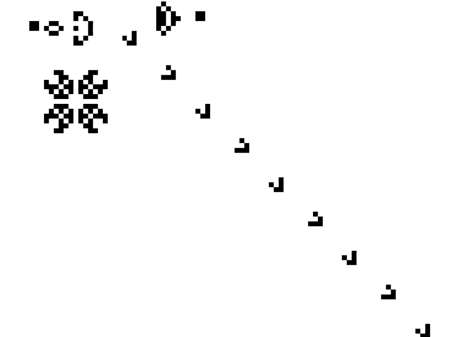

 

# Conway’s Game of Life

## Introduction

**Conway's Game of Life** is a fascinating and famous cellular automaton, a mathematical model that simulates the evolution of life in a grid of cells. Created by the British mathematician John Conway in 1970, this "game" has captivated the minds of mathematicians, computer scientists, and enthusiasts for decades.

At its core, the Game of Life operates on a grid, often a 2D grid, where each cell can be in one of two states: alive or dead. The evolution of the system is determined by a set of rules that dictate the fate of each cell based on its current state and the states of its neighboring cells. These rules are simple yet give rise to a wide array of complex and mesmerizing patterns.

Here are the basic rules of Conway's Game of Life:

1. **Any live cell with fewer than two live neighbors dies (underpopulation).**
2. **Any live cell with two or three live neighbors lives on to the next generation.**
3. **Any live cell with more than three live neighbors dies (overpopulation).**
4. **Any dead cell with exactly three live neighbors becomes a live cell (reproduction).**

These rules are applied simultaneously to all cells in the grid in each generation, leading to a dynamic and ever-changing "population" of cells.

The Game of Life doesn't require any player input; it evolves automatically. Its beauty lies in the incredible variety of patterns and structures that can emerge, including oscillators, spaceships, and gliders. It has been used as a tool for studying complex systems, artificial life, and even as a metaphor for life itself.

The Game of Life is also popular in computer science and programming, often used as a challenge or an educational tool. Enthusiasts have developed various simulations and visualizations, making it accessible for anyone to explore and appreciate.

## Objectives

The objectives of this project are the following:
• write a naive implementation of Conway’s Game of Life using C “matrices”. This implementation will allow
to load the initial configuration from a text file and produces a list of images corresponding to each step of the
simulation.
• write a more efficient implementation using a linked list
• read an initial state of the grid in Conway’s Game of Life from a text file

## Project

Here are the rules to execute the project.
It is composed in 2 parts, the first is with the generation of a naive universe, 
the second is the same but with linked-chain (it aloads the universe to extend).

### QUICK LOOK AT THE DIRECTORIES
- project         : it contains all the project directories and files
- project/data    : it contains all the txt files needed for creating universes
- project/src     : it contains all the .c files except the test files
- project/test    : it contains all the test-X...X.c files
- project/include : it contains all the .h files needed to link the scripts
- project/out     : it contains all the images and videos generated by the scripts

### GENERAL RULES OF THE MAKEFILE
/!\ the commands involving make shall be executed in the project directory (where the MAKEFILE is)
(?) adding -wd will launch most of the commands on a Windows device

- compile-all      : compile all the test and app script into executables in the project directory               
- clear            : erase the .o and exectables files from the project directory                                       (-wd)
- launch-tests     : will compile and launch all tests                                                                  (-wd)
- doc              : will generate the doxygen documentation
- check-syntax     : will generate the .o file of each file and so verify the syntax while compiling
- compile-all-ex   : will compile all files even the examples
- video            : will create a video.mp4 using ppm images                                                           (-wd)
                      -you can regulate the frame by adding FRAME  = <number_of_images_per_second> (5 by default)  
                      -you can name the mp4 file created    NAME   = <name_of_the_file.mp4>        (video.mp4 by default)
                      -you can change the height and width  HEIGHT = <height_of_the_video>         (768 by default)
                                                            WIDTH  = <width_of_the_file>           (1024 by default)
- clear-img        : will remove all .o and .mp4 files                                                                  (-wd)

1. NAIVE:
/!\ the commands shall be executed in the project directory after having compiled all the needed files 
(make compile-all (-wd) or make <name_of_the_executable>)

- tests :
  -> ./test-naive-universe       : test the universe structure and basic fonction on this structure
  -> ./test-naive-load           : test the loading and writing fonction from and of a universe.txt
  -> ./test-naive-conway         : test the application of the conway's rules on a given universe
  -> ./test-naive-generate-image : test the creation of ppm images from txt universe
- app : 
(replace universe.txt by the universe you want to load glider.txt for example)
  -> ./app-naive-loader ./data/universe.txt : load a universe txt file and prints it in the console
  -> ./app-naive-conway ./data/universe.txt : load a universe txt file apply the conway's step and prints it in the console as well as creating ppm images in the out directory

- all : 
 -> comp-all-naive : compile all the naive files 

2. LIST:
/!\ the commands shall be executed in the project directory after having compiled all the needed files 
(make compile-all (-wd) or make <name_of_the_executable>)

- tests :
  -> ./test-linked-list-cells    : test the linked list structure and fonctions
  -> ./test-list-universe        : test the universe structure and basic fonction on this structure
  -> ./test-list-load            : test the loading and writing fonction from and of a universe.txt
  -> ./test-list-conway          : test the application of the conway's rules on a given universe
  -> ./test-list-ppm-writer      : test the creation of ppm images from txt universe

- app : 
(replace universe.txt by the universe you want to load glider.txt for example)
  -> ./app-list-loader ./data/universe.txt : load a universe txt file and prints it in the console
  -> ./app-list-conway ./data/universe.txt : load a universe txt file apply the conway's step and prints it in the console as well as creating ppm images in the out directory

- all : 
 -> comp-all-list : compile all the linked list files 